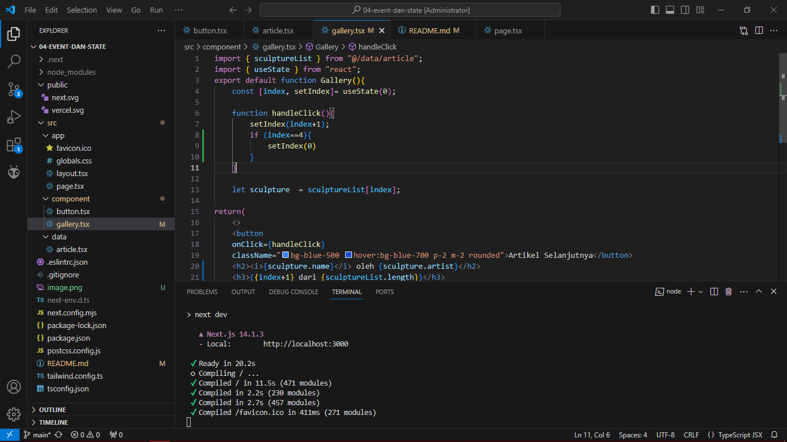

Soal
Jika kita menekan tombol "Artikel Selanjutnya" sebanyak 5x (atau melebihi halaman total artikel), apa yang akan terjadi?
Jawab:

Modifikasilah gallery.tsx agar bisa meng-handle permasalahan tersebut.

Tambahkan tombol "Artikel Sebelumnya", untuk menampilkan artikel secara mundur.

Silahkan laporkan dan commit dengan judul Jawaban Soal Praktikum 4

Soal
Apa perbedaan dari fungsi Form_2 yang pertama dengan yang kedua?
menambahkan first name dan nama lengkap seseorang kedalam bentuk form,perbedaan yang paling menonjol terletak pada source code,pada model yang pertama ada state "fullName" pada fungsi setFirstName dan setLastName dan oleh karena itu ditemukan banyak bug

Kenapa perlu menghapus state fullName? Apa keuntungannya?
keuntunganya adalah source code menjadi lebih simpel dan lebih mudah untuk dipahami dan karena itu diperlukan untuk menghapus state fullName agar dapat lebih mudah dalam menemukan error
Silahkan laporkan dan commit dengan judul Jawaban Soal Praktikum 5

Soal
Apa tujuan dari penulisan ini key={to.email} pada < Chat key={to.email} contact={to} / > ?
memberikan kunci unik pada elemen Chat yang dibuat. Kunci ini umumnya digunakan dalam React untuk membantu dalam proses rendering yang efisien
Apa fungsi dari props key tersebut?
Ketika kunci tersebut ditambahkan, textArea berubah. Sebelumnya, teks yang terisi dalam textarea tetap dipertahankan meskipun kita berpindah ke kontak lain/klik tombol lain. Setelah itu, setelah kuncinya diubah, area teks akan dihapus setiap kali kita berpindah ke kontak lain.
Silakan laporkan dan commit dengan judul Jawaban Soal Praktikum 6